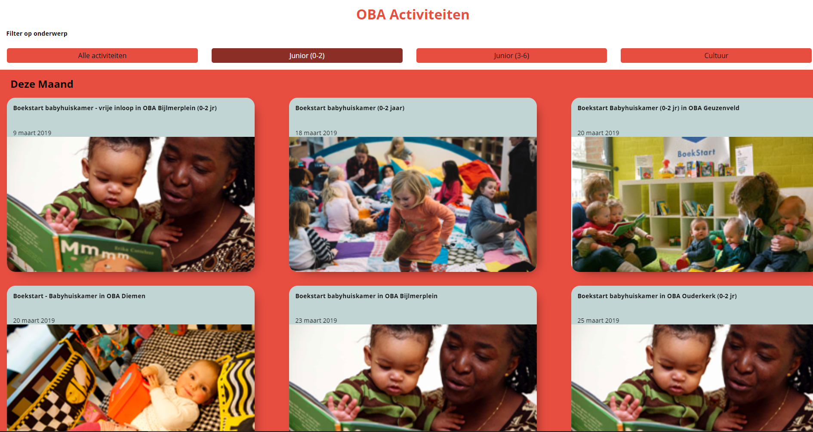

# Project 1 @cmda-minor-web · 2018-2019

## Concept

The many different activities that are done by, and inside, the OBA are shown in a rather boring list of items. Exactly the same as the books you can loan. My idea is to make the look of the activities diffrentiate from the books and make the browsing through them more intuative. This project was only one week, it was also know as the pressure cooker.

## Demo
[DEMO](https://sharp-lumiere-868017.netlify.com/)

## API
The API I used for this project is the OBA API. One of my classmates ([maanlamp](https://github.com/maanlamp/OBA-wrapper)) wrote a wrapper for this API so it doesn't get overflown with to many requests. The data returned was a pain in the ass most of the times. But I maaged to get done what I wanted to get done

## Prototype

For this prototype I used plain javascript to make a frontend application. I made a dynamic filter function that gets the subjects from the data. For now the prototype only gets the activities from this and next month.
